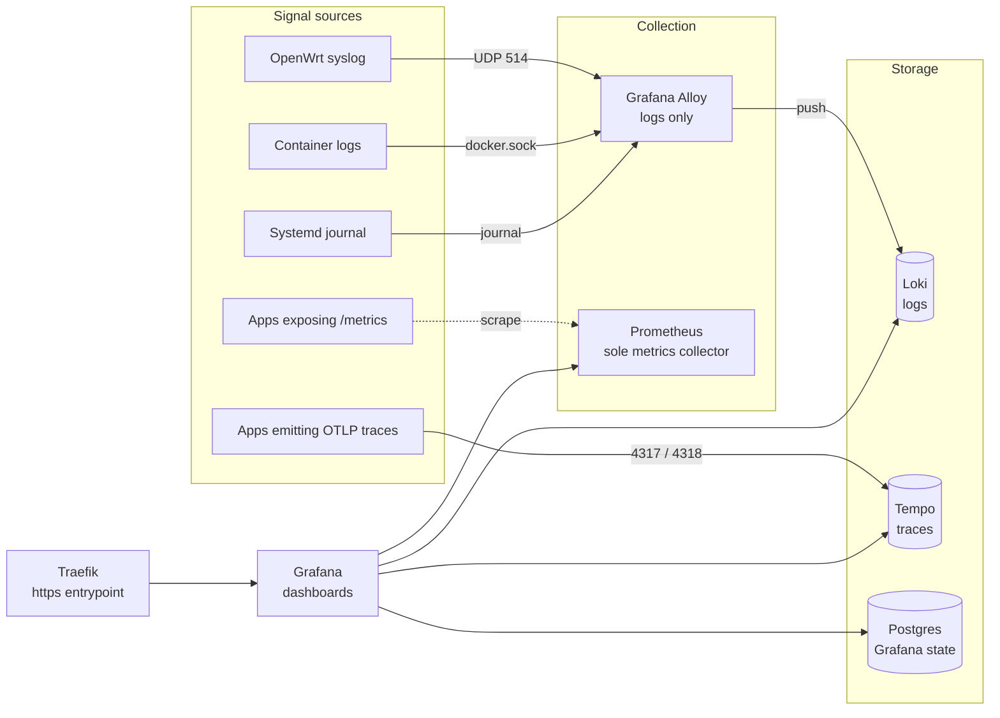

# grafana — homelab observability stack (LGTM)

Central observability suite for the homelab: **G**rafana dashboards over **L**oki (logs), **T**empo (traces) and Prometheus (metrics), with Grafana Alloy as the log collector and a dedicated Postgres for Grafana state. Deployed from `/opt/stacks/grafana` on `internal.lan`, every service on the external `shared` network, web UIs routed through Traefik.

## What's inside

```
stacks/grafana/
├── compose.yaml          # 6 services, shared network, Traefik + Prometheus labels
├── .env.example          # copy to .env (gitignored) before first up
├── config/
│   ├── grafana/          # grafana.ini + provisioning
│   │   └── provisioning/
│   │       ├── dashboards/   # Dashboard schemas and providers
│   │       └── datasources/  # Datasource schemas
│   ├── prometheus/       # scrape config — label-gated docker_sd, the sole metrics collector
│   ├── loki/             # Loki config (schema v13, 30d retention)
│   ├── tempo/            # Tempo config (OTLP receivers)
│   └── alloy/            # log collection + parsing pipelines (syslog/docker/journal → Loki)
├── scripts/              # validation helpers (check.sh, audit.sh)
└── data/                 # runtime state — gitignored, never committed
```

## Services

| Service | Image | Role |
|---|---|---|
| `grafana` | `docker.io/grafana/grafana:13.2` | Dashboards & query UI; provisions datasources and dashboards from `config/grafana/provisioning/`; state in Postgres |
| `prometheus` | `docker.io/prom/prometheus:v3` | Metrics storage + **sole metrics collector** — discovers containers via `docker_sd`, gated by two labels (see below) |
| `loki` | `docker.io/grafana/loki:3.7` | Log aggregation — all container logs, OpenWrt syslog, systemd journal |
| `grafana-tempo` | `docker.io/grafana/tempo:3.0.0` | Trace storage + OTLP intake for the LAN (ports `4317` gRPC / `4318` HTTP published on the host) |
| `grafana-alloy` | `docker.io/grafana/alloy:v1.9.0` | **Logs-only** collector: OpenWrt syslog (UDP `514`), Docker logs, systemd journal → Loki |
| `grafana-db` | `docker.io/postgres:17.11-alpine` | Grafana's database |

## Architecture



## Adding a new stack: metrics, logs, traces

### Logs — automatic, no opt-in

Alloy tails every container's log stream (15 s docker discovery). As soon as the stack is up, its logs reach Loki with unified stream labels:

- `project` — compose project name
- `service_name` — compose service name
- `container_name` (and `container_id` as structured metadata)
- `job="docker"`

Query in Grafana (Explore → Loki): `{project="mystack", service_name="myservice"}`. Known services carry a normalized `level` stream label (`trace|debug|info|warn|error|fatal`), and OpenWrt syslog plus the systemd journal are normalized to that same vocabulary at ingest (Alloy `loki.relabel` in `config/alloy/config.alloy`), so `{job="docker", level="error"}`, `{job="openwrt", level="warn"}` and `{job="systemd", level="error"}` all work as stream selectors; query-time `| detected_level="error"` keeps working too (journal entries without a PRIORITY field still fall back to it). Per-service structured metadata adds `pg_severity`/`pid` (postgres), `target` (dbx), `component` (dockhand), `logger`/`component`/`caller`/`source` (grafana/alloy/tempo/loki/prometheus) and traefik `method`/`status`; unknown containers keep query-time auto-detection only. dockhand stack traces/chatter and postgres `docker-entrypoint` banner/blank lines are dropped at ingest.

### Metrics — opt-in with two labels

Add both labels to every service that exposes a metrics endpoint:

```yaml
services:
  myservice:
    labels:
      prometheus.path: /metrics   # endpoint path (leading slash optional)
      prometheus.port: "8080"     # container port
```

That is the complete opt-in: Prometheus's single `docker-stacks` job discovers the container and scrapes `<container-ip>:<port><path>`. Target labels match the log stream labels (`project`, `service_name`, `container_name`, `container_image`), so the same selector works in both Prometheus and Loki. Dotted spelling (`prometheus.path`) is canonical; underscored (`prometheus_path`) also works — never both spellings of one label. Like every other stack, join the external `shared` network.

Verify: `up{project="mystack"}` in Grafana (Explore → Prometheus) or the Prometheus *Targets* page.

### Traces — point the app at Tempo

Export OTLP from the app to the host-published Tempo intake:

```yaml
environment:
  OTEL_EXPORTER_OTLP_ENDPOINT: http://internal.lan:4317   # gRPC (or :4318 for HTTP)
  OTEL_TRACES_EXPORTER: otlp
```

Traces then show up in Grafana (Explore → Tempo → Search).

### Dashboards — provisioned JSON

1. Drop the dashboard JSON into a provider folder: `config/grafana/provisioning/dashboards/<folder>/` — folders: `host`, `container-stacks`, `networks`, `distributed-tracing` (add a new provider in `provisioning/dashboards/dashboards.yaml` for a new folder).
2. Sync to the deploy host and reload provisioning (file provisioning does **not** reliably auto-reload):

   ```sh
   curl -s -X POST -u admin:admin \
     http://internal.lan/api/admin/provisioning/dashboards/reload
   ```

3. Query conventions that keep panels honest:
   - Use the unified labels (`project`, `service_name`) — identical in Prometheus and Loki.
   - LogQL keyword is `| regexp` (not `| regex`); metric queries wrap aggregations explicitly, e.g. `sum by (x) (count_over_time({project="mystack"} | regexp "..." [5m]))` — there is no `stats by (…)` form.
   - Timeseries panels use short windows (`[5m]`) with a range query; table/pie/barchart panels use a long window (`[6h]`) with `queryType: instant`.
4. Validate before calling it done:

   ```sh
   cd /opt/stacks/grafana
   scripts/check.sh file config/grafana/provisioning/dashboards/<folder>/<name>.json
   scripts/check.sh    # whole suite: PASS/WARN/FAIL, exit 0 = no failures
   ```

## Scripts

| Script | Purpose |
|---|---|
| `scripts/check.sh` | Full suite: validates every provisioned dashboard's queries against the live backends — PASS/WARN/FAIL summary, exit `0` (clean) / `1` (failures) / `2` (usage/setup error). Subcommands: `probe <loki\|prom\|tempo\|tempo-search\|tempo-metrics> <expr>` (raw response for one query) and `file <dashboard.json>` (every target expr — pre-deploy validation) |
| `scripts/audit.sh` | Read-only stack health audit (`--push` adds harmless write probes, `--quick` for a fast pass) |

All scripts run on the deploy host: `cd /opt/stacks/grafana && scripts/<name>`.

## Operations

```sh
cd /opt/stacks/grafana
docker compose ps                 # status + health
docker compose logs -f <service>
docker compose config -q          # validate after edits
docker compose up -d              # apply
```

- First setup: `cp .env.example .env`, edit, `docker compose up -d`.
- Local copy is the single source of truth (ruling 2026-09-28); deploy local → remote with `rsync -a --exclude-from=.agents/grafana-deploy-excludes.txt stacks/grafana/ internal.lan:/opt/stacks/grafana/` (never `--delete`; `README.md` is included so both copies stay identical).
- Only two host-published data ports: Tempo OTLP (`4317`/`4318` tcp) and Alloy syslog (`514` udp); all web UIs are Traefik-only.
- Loki truncates log lines at **3072 B** (`limits_config.max_line_size` + `max_line_size_truncate`, identifier `...[truncated]`). Giant lines (arcane slow-query SQL was ~163 KB) tripped Loki's 4 MB gRPC query-response cap and broke every raw-line fetch — Drilldown's logs list (`limit=1000`), Explore, check.sh — with `ResourceExhausted`. Full-length lines remain in docker's json-file logs (`docker logs arcane`). Lines ingested before the 2026-09-28 change stay giant until they age out of the query window (~2 h at arcane's rate).